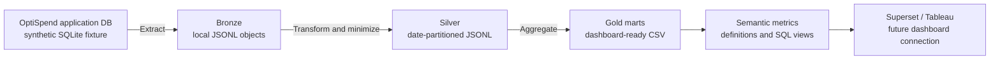

# OptiSpend data engineering and analytics layer

This is a separate prototype workstream from the OptiSpend application. It demonstrates an ETL flow from a **synthetic application database** to a local data lake layout, then produces curated marts and semantic metrics for dashboard tools.



The local folder layout stands in for object storage. It is not an S3 bucket. The app’s purchase-check API does not feed this pipeline; the SQLite database is a synthetic source fixture created by the pipeline so the ETL can be demonstrated independently. No Plaid, Sahamati, Kafka, Flink, S3, warehouse, Superset, Tableau, or real user data is connected.

## Run the prototype

From the repository root:

```sh
python3 data-engineering-analytics/pipeline.py
```

The script creates a synthetic application database, extracts new rows using an ID watermark, writes Bronze and Silver JSONL objects, rebuilds Gold CSV marts, and records a local checkpoint. Runtime files are generated under `data-engineering-analytics/runtime/` and are excluded from Git.

## Data layers

- **Source:** `runtime/source/application.db`, a generated SQLite fixture with only a check ID, category, planned amount, guidance outcome, and timestamp.
- **Bronze:** append-only JSONL batches representing source-shaped lake objects, with an ingestion timestamp.
- **Silver:** validated, deduplicated analytical records partitioned by event date. Exact purchase amounts are transformed into broad amount bands.
- **Gold:** aggregate CSV marts by day, category, and guidance outcome. Amount totals use band midpoints, so they are estimates rather than exact spend.
- **Semantic layer:** `semantic/metrics.yml` defines dashboard names and measures; `semantic/metrics.sql` shows example views over the Gold marts.
- **Dashboard handoff:** for a Superset prototype, upload `purchase_checks_by_category.csv` and `purchase_checks_daily.csv` from the Gold folder as datasets, then apply the dimensions and measures in `semantic/metrics.yml`. Tableau can use the same CSV exports. The prototype does not deploy either tool or create a live connection.

## Future production shape

Replace the synthetic SQLite fixture with a controlled, read-only extractor from the application database. Use scheduled ETL or CDC to land consent-scoped, minimized records in an S3-compatible object store; keep Bronze, Silver, and Gold schemas versioned; and publish curated tables through a query engine and semantic layer. Superset can consume approved datasets for internal product analytics. Kafka/Flink may be considered for operational streaming, but they are not required for this batch ETL design and are not part of this prototype.

Keep application behavior and analytics workloads separate. The application backend serves the user’s purchase check. This data-engineering component reads its own synthetic source and produces aggregate reporting data; it does not block purchases or return recommendations to users.
